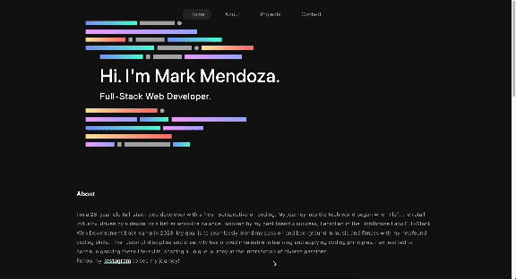

# Mark Mendoza's Portfolio

A Web Developer portfolio page, featuring various sections.

## Built With:

- `React:` A JavaScript library for building user interfaces.
- `TypeScript:` Adds static types to JavaScript for safer and more predictable code.
- `React Icons:` Utilized for scalable vector icons.
- `CSS:` For styling.
- `Framer Motion:` For animation effects.
